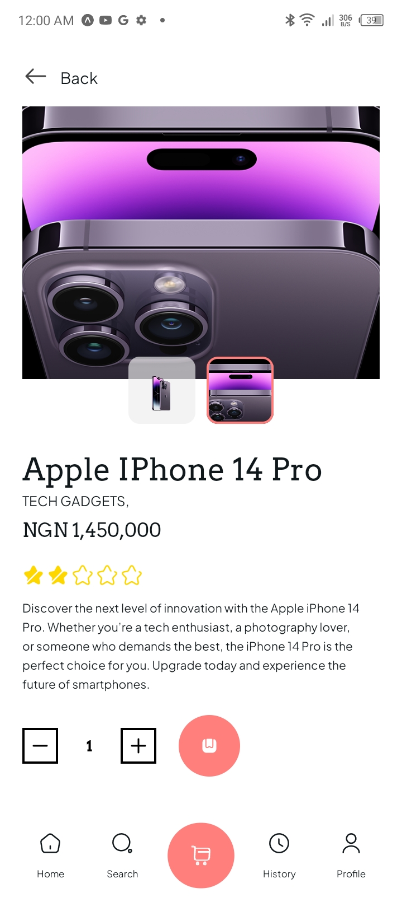
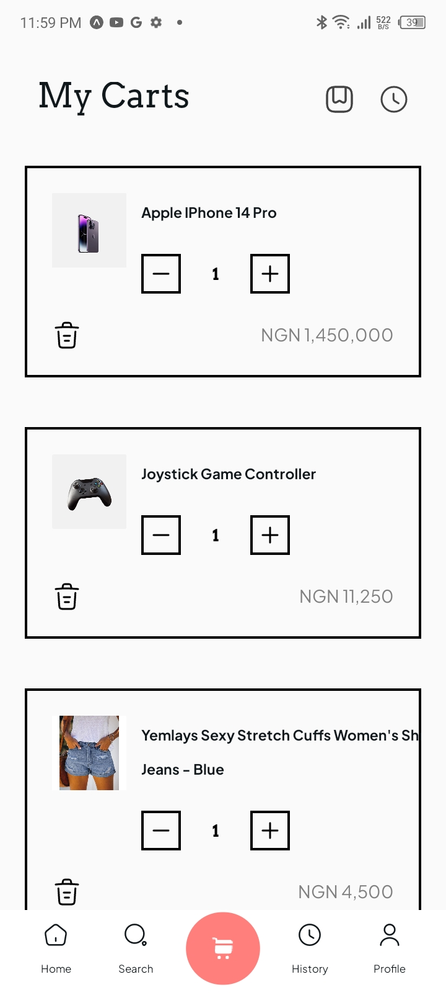
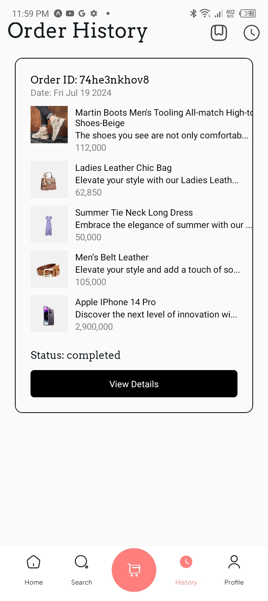

# My React Native Shopping App


A React Native application for shopping that allows users to browse products, add them to a cart, and proceed to checkout using the timbu api.

## Table of Contents

- [Features](#features)
- [Screenshots](#screenshots)
- [Installation](#installation)
- [Usage](#usage)
- [Download](https://expo.dev/artifacts/eas/kWKQqZgdmiR2N3DZzs19wC.apk)
- [Appetize](https://appetize.io/embed/b_vqz7klq5id4yvpkgxxdmsb3dii)
- [License](#license)

## Features

- Browse products
- Add products to the cart
- View cart items
- Checkout

## Screenshots









<video src="./assets/screenshot/screen-record.mp4"></video>

## Installation

### Prerequisites

- Node.js >= 14.x
- npm >= 6.x or yarn >= 1.x
- Expo CLI

### Setup Instructions

1. **Clone the repository**

```bash
git clone https://github.com/Timi-Leyin/malltiverse.git
cd malltiverse
yarn install
yarn start
```
